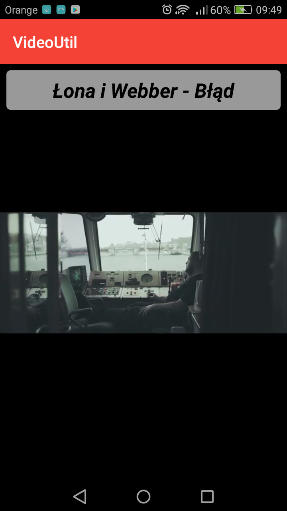
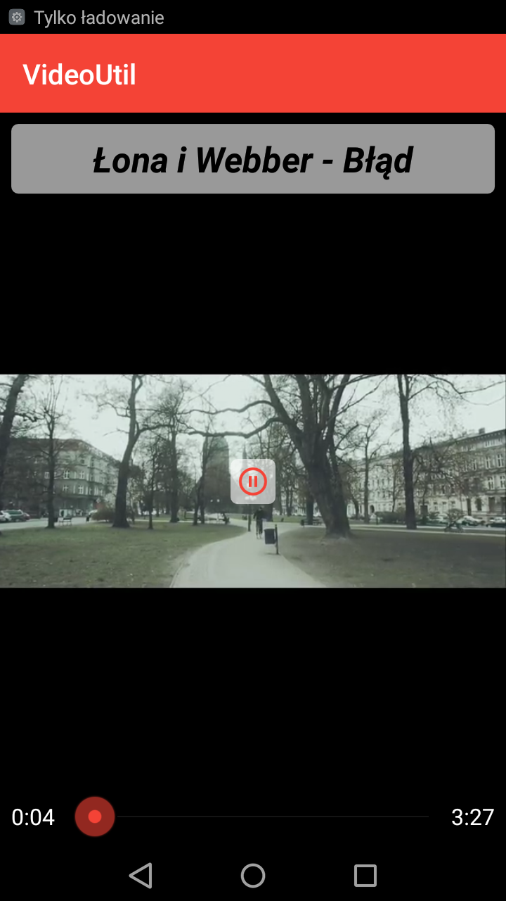
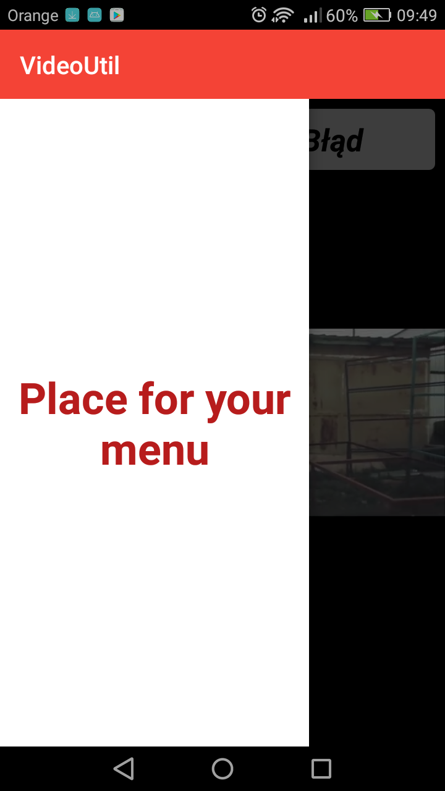

# VideoUtil for Android

## Introduction

This is open-source project for everyone who wants to show something over YouTubePlayer view.

## Used libs

It used [YouTubeAndroidPlayerApi 1.2.2](https://developers.google.com/youtube/android/player/).

## How to do it

To show anything over YouTubePlayer you must to create your own DialogFragment and show it over your activity with youtubeplayer in onResume() method.

Everything what you want to show on player you must put into dialog fragment. That allows you to keep video plaing.

Also you must remember, that in this case you should use Chromeless style (without any YouTube icons) and to create your own controllers in dialog fragment. When you do that in xml file, remember to implement PlaybackEventListener and PlayerStateChangeListener interfaces. It allows you to management icons like in YouTube.

The rest depends on your needs and can be done in any way.

## Examples

Normal View

Controllers

Menu
